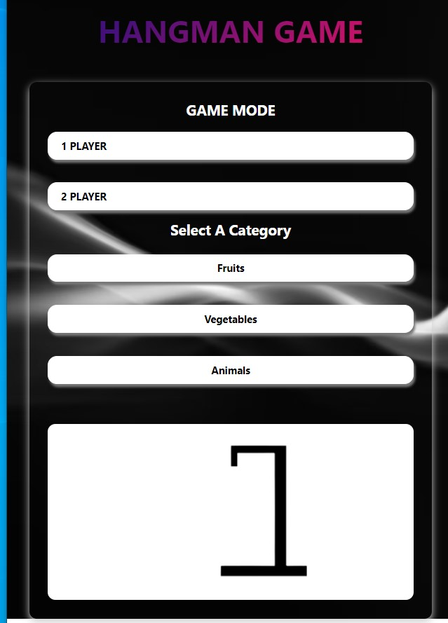

# Hangman Game Project

## Description

Hangman is a simple word guessing game. Players try to figure out an unknown word by guessing letters. If too many letters which do not appear in the word are guessed, the player is hanged (and loses).

Let us see how this game works. Chose either 1 Player or 2 Player Game Mode. Next, choose from three options: ‘Fruits’, ‘Vegetables’ and ‘Animals’. Once the user selects the options, the computer chooses a word from the corresponding category.

Now, the user(s) has to guess the chosen word using the letter buttons provided on the screen. The user can make six wrong attempts before he loses the game. Most frequently, the person is drawn in 6 parts (for 6 letter guesses) in the order: head, body, left leg, right leg, left arm, right arm.

If the user(s) guesses the word, we display a winning message on the screen. If not, we display a lost message. Along with this message, we also provide the user with the solution and a button to start a ‘New Game’.

## Tech Stack

- HTML
- CSS
- Javascript

## Upcoming Features

- Add More Categories
- Timed Game Mode
- Seasonal Themes(Halloween, Thanksgiving, Christmas, etc.)

 